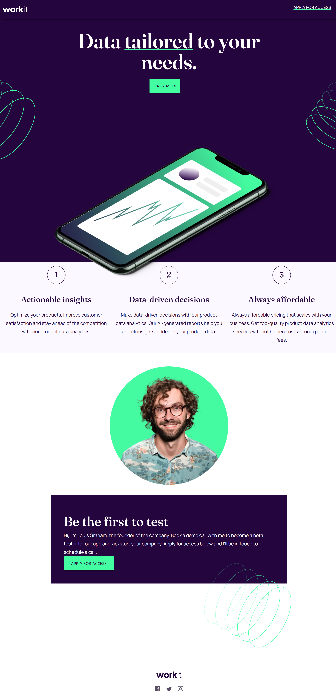

# Frontend Mentor - Workit landing page solution

This is a solution to the [Workit landing page challenge on Frontend Mentor](https://www.frontendmentor.io/challenges/workit-landing-page-2fYnyle5lu). Frontend Mentor challenges help you improve your coding skills by building realistic projects.

## Table of contents

* [Overview](#overview)
    * [The challenge](#the-challenge)
    * [Screenshot](#screenshot)
    * [Links](#links)
* [My process](#my-process)
    * [Built with](#built-with)
    * [What I learned](#what-i-learned)
    * [Continued development](#continued-development)
    * [Useful resources](#useful-resources)
* [Author](#author)

## Overview

### The challenge

Users should be able to:

* View the optimal layout for the interface depending on their device's screen size
* See hover and focus states for all interactive elements on the page

### Screenshot



### Links

* Solution URL: [Add solution URL here](https://your-solution-url.com)
* Live Site URL: [Add live site URL here](https://your-live-site-url.com)

## My process

### Built with

* Semantic HTML5 markup
* CSS custom properties
* Materialize - CSS framework

### What I learned

For this project, I wanted to explore using a CSS framework while also implementing the CSS knowledge that I previously learned. This added another set of challenges since I was unable to fully recreate the design. However, this encouraged me to learn and use other frameworks that will allow me to quickly

Code used to utilize Materialize:

``` html
<link rel="stylesheet"
      href="https://cdnjs.cloudflare.com/ajax/libs/materialize/1.0.0/css/materialize.min.css">
```

Fonts imported for the project:

``` css
@font-face {
    font-family: 'Fraunces';
    src:url('./assets/fonts/fraunces/Fraunces-VariableFont_SOFT\,WONK\,opsz\,wght.ttf');
  }

@font-face {
    font-family: 'Manrope';
    src: url('./assets/fonts/manrope/Manrope-VariableFont_wght.ttf');
}
```

### Continued development

I want to focus on how to better implement frameworks for future projects. When researching which framework to use, I enjoyed reading about the many features and tools they offer to the developer. I believe having a better understanging of frameworks will assist with some of the more tedious aspects of coding.

### Useful resources

* [Materialize CSS](https://materializecss.com/) \- The framework used for the project\. Contains useful information on what it is and how to use it\.

## Author

* Frontend Mentor - [@yourusername](https://www.frontendmentor.io/profile/blordeus)
* Twitter - [@yourusername](https://www.twitter.com/blordeus)